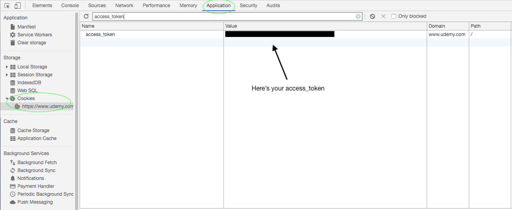

# udemy_downloader

This is udemy course downloader, before a start you know how  to get access token.

To get the access_token on Google Chrome (once on Udemy.com):

First, right-click anywhere on the page, then click on “Inspect”

Click on “Applications”

Click on “Cookies”

Then search for “access_token”. It should look like a random string.

</img>

sample access _token look likes:

```
access_token=BwlEeqk39otSBB5nnKKphJdb9r460Wdx124vqKop
```

After that run this command on cmd :

```
pip install -r requirements.txt --no-index --find-links libraries
```


