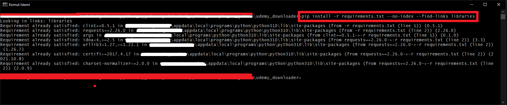
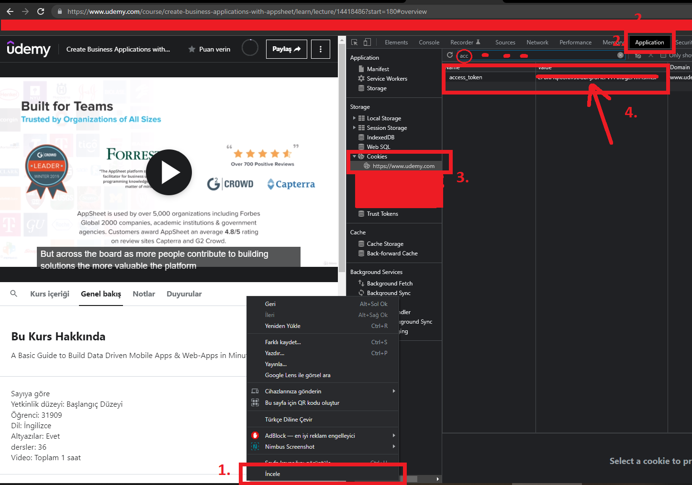

# udemy_downloader

Download all of this folder and run this command on cmd :

```
pip install -r requirements.txt --no-index --find-links libraries
```
### Cmd ekran görüntüsü
</img>


This is udemy course downloader. this script created Python programming language.

`Udemy Downloader, bu script Python programlama dili ile hazırlanmıştır`

Before a start you know how to get access_token.

`Başlamadan önce access_token i nasıl elde edeceğinizi bilmeniz gerekir.`

To get the access_token on Google Chrome (once on Udemy.com):

`access_token değerini Google Chrome dan (udemy.com üzerinden) almak için:`

First, right-click anywhere on the page, then click on “Inspect”

`udemy.com a giriş yaptıktan sonra, sayfanın herhangi bir yerinde sağ tıklayıp "İncele" ye tıklıyoruz`

Click on “Applications”

`ekran görüntüsünde de görüleceği üzere "Applications" a tıklıyoruz`

Click on “Cookies”

`sol kısımda Cookies e tıklıyoruz`

Then search for “access_token”. It should look like a random string.

`ekranın sağına gelen kısımda arama kutucuğuna access_token yazıp arıyoruz`

### Örnek ekran görüntüsü
</img>

### Örnek ekran görüntüsü
</img>

sample access_token look likes:

`örnek access_token aşağıdaki gibi görünecektir`

```
access_token=BwlEeqk39otSBB5nnKKphJdb9r460Wdx124vqKop
```

You have to input this value:

`Programa bu değeri gireceğiz`

```
BwlEeqk39otSBB5nnKKphJdb9r460Wdx124vqKop
```


